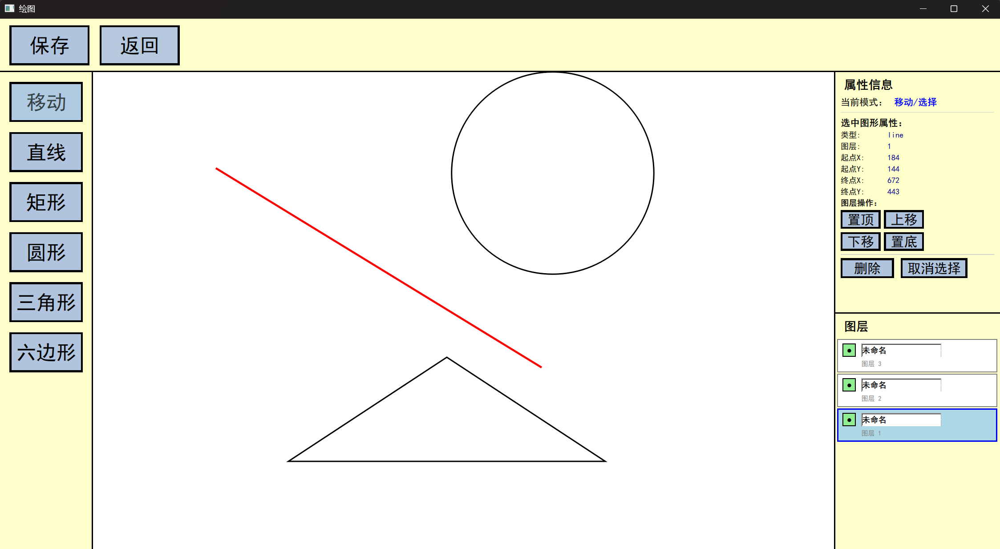

"# 图形绘制编辑器

一个基于 Qt Quick 开发的现代化图形绘制应用程序，支持多种几何图形的创建、编辑、拖拽和图层管理。



## ✨ 功能特性

### 🎨 图形绘制
- **多种图形支持**：矩形、圆形、三角形、六边形、直线
- **实时预览**：绘制过程中显示虚线预览
- **精确绘制**：基于起点和终点的坐标计算

### 🖱️ 交互操作
- **图形选择**：点击选中图形，红色轮廓显示
- **拖拽移动**：移动模式下拖拽图形到任意位置
- **视觉反馈**：拖拽时橙色轮廓和阴影效果
- **智能光标**：根据模式和悬停状态自动变化

### 📑 图层管理
- **多图层支持**：每个图形独立图层
- **图层排序**：置顶、置底、上移、下移操作
- **可见性控制**：单独控制每个图形的显示/隐藏
- **图层命名**：支持重命名图层，实时保存

### 📊 属性查看
- **实时属性显示**：坐标、尺寸等详细信息
- **类型识别**：自动显示图形类型
- **图层信息**：当前图层级别显示

### 💾 文件操作
- **JSON格式保存**：完整保存图形数据和属性
- **文件加载**：支持加载之前保存的绘图
- **未保存提醒**：退出时提醒保存更改

## 🏗️ 技术架构

### 前端 (QML)
```
├── Main.qml           # 应用程序主窗口
├── MainPage.qml       # 欢迎页面
├── PaintPage.qml      # 绘图主页面
├── GCanvas.qml        # 绘图画布组件
├── ToolsPanel.qml     # 左侧工具面板
├── RightPanel.qml     # 右侧属性面板
├── MyButton.qml       # 自定义按钮组件
└── MyDialog.qml       # 自定义对话框组件
```

### 后端 (C++)
```
├── main.cpp               # 应用程序入口
├── graphiclogic.h/cpp     # 图形管理核心逻辑
├── abstractgraphic.h/cpp  # 图形抽象基类
├── grectangle.h/cpp       # 矩形图形类
├── gcircle.h/cpp          # 圆形图形类
├── gtriangle.h/cpp        # 三角形图形类
├── ghexagon.h/cpp         # 六边形图形类
└── gline.h/cpp            # 直线图形类
```

## 🚀 快速开始

### 环境要求
- **Qt 6.8+**：Qt Quick 和 Qt Core 模块
- **CMake 3.16+**：构建系统
- **C++17**：编译器支持
- **Windows/Linux/macOS**：跨平台支持

### 编译构建

1. **克隆项目**
```bash
git clone "https://github.com/1l6suj7/Paint"
cd Paint
```

2. **创建构建目录**
```bash
mkdir build && cd build
```

3. **配置和编译**
```bash
cmake ..
cmake --build .
```

4. **运行应用**
```bash
# Windows
./appPaint.exe

# Linux/macOS
./appPaint
```

### Qt Creator 开发
1. 打开 `CMakeLists.txt`
2. 配置 Qt 6.8+ 工具链
3. 构建并运行

## 📖 使用指南

### 基本操作

1. **启动应用**
   - 点击"开始绘图"进入绘图界面

2. **绘制图形**
   - 选择左侧工具面板中的图形类型
   - 在画布上拖拽绘制图形
   - 实时预览显示绘制效果

3. **编辑图形**
   - 点击"移动"工具进入编辑模式
   - 点击选中图形（红色轮廓）
   - 拖拽移动到新位置

4. **图层管理**
   - 右侧面板查看图层列表
   - 使用图层操作按钮调整顺序
   - 点击可见性按钮控制显示

5. **保存工作**
   - 点击"保存"按钮
   - 选择 JSON 文件位置保存

### 高级功能

#### 图层重命名
- 点击图层名称进入编辑模式
- 输入新名称并按回车确认
- 按 ESC 取消编辑

#### 键盘快捷键
- **回车**：确认图层重命名
- **ESC**：取消编辑操作

#### 鼠标操作
- **单击**：选择图形或工具
- **拖拽**：绘制图形或移动图形
- **悬停**：显示相应光标提示

## 🔧 开发扩展

### 添加新图形类型

1. **创建图形类**
```cpp
class GNewShape : public AbstractGraphic {
    // 实现虚函数
    QJsonObject toJson() override;
    void loadFromJson(QJsonObject obj) override;
    void loadFromCoord(QVector2D st, QVector2D ed) override;
    bool isInnerSpace(qreal x, qreal y) override;
    void updatePosition(QVector2D relPos) override;
};
```

2. **注册到 GraphicLogic**
```cpp
// 在 newGraphic() 方法中添加
else if (type == "newshape") {
    gra = new GNewShape(info);
}
```

3. **添加 QML 绘制支持**
```qml
// 在 GCanvas.qml 的 drawSingleGraphic() 中添加
case "newshape":
    drawNewShape(ctx, info);
    break;
```

### 自定义工具面板

1. **修改 ToolsPanel.qml**
2. **添加新的 MyButton 组件**
3. **设置对应的 drawMode**

### 扩展文件格式

当前支持 JSON 格式，可扩展支持：
- **SVG 导出**：矢量图形格式
- **PNG/JPEG 导出**：位图格式  
- **自定义二进制格式**：更高效的存储

### 开发流程
1. Fork 项目仓库
2. 创建功能分支 (`git checkout -b feature/AmazingFeature`)
3. 提交更改 (`git commit -m 'Add some AmazingFeature'`)
4. 推送分支 (`git push origin feature/AmazingFeature`)
5. 创建 Pull Request

**项目版本**: 0.1  
**最后更新**: 2025年10月4日  
**开发语言**: C++ / QML  
**支持平台**: Windows, Linux, macOS" 

> 本 README 内容部分由 AI 智能助手（Claude Sonnet 4）自动生成，并由作者后续修改整理。